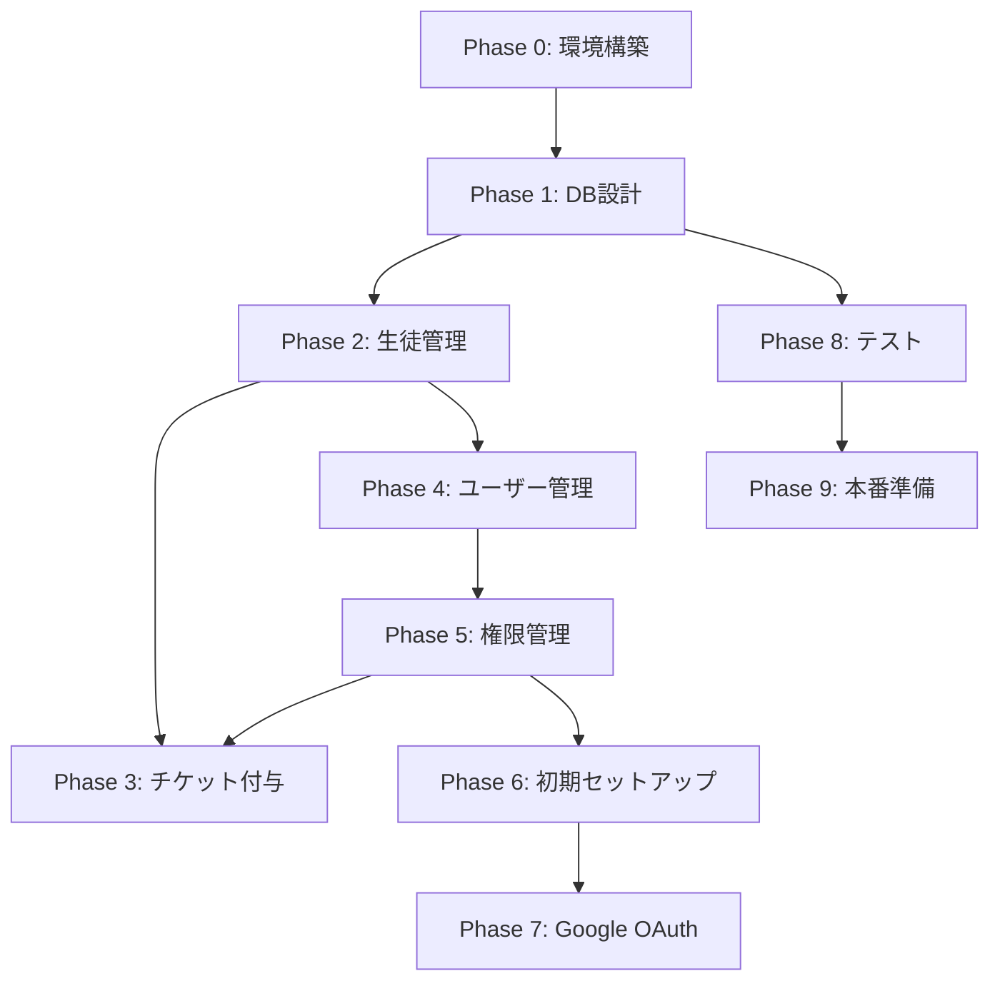

# 英会話サービス管理画面 - AI開発指示書

## 🎯 プロジェクト概要

**目的**: 英会話サービスの管理画面をLaravel + Filamentで構築する
**技術スタック**: Laravel 12.x, Filament 3.3, PHP 8.3+, MySQL 8.0
**開発方針**: Filament標準コンポーネントを最大限活用し、カスタマイズは最小限に抑える
**環境構築**: ローカルPHP環境を使用（Docker不要）

## 📋 重要な開発原則

### 1. Filamentファースト原則
- **必須**: Filamentの標準コンポーネントのみを使用する
- **禁止**: カスタムLivewireコンポーネントの作成
- **禁止**: カスタムビューファイルの作成（必要な場合はrenderHookを使用）
- **推奨**: FilamentのForm Builder、Table Builder、Action、Infolistを最大限活用

### 2. コード品質基準
- Laravel Pintによるコーディング規約統一
- PHPStan レベル5以上での型安全性確保
- Filamentのベストプラクティスに従う
- N+1問題を防ぐためのEager Loading使用

## 🚀 段階的開発計画

### 📌 Phase間の依存関係



**重要な依存関係:**
- Phase 3（チケット付与）は Phase 5（権限管理）完了後に権限制御を追加
- Phase 5（権限管理）は Phase 4（ユーザー管理）が必須
- Phase 6（初期セットアップ）は Phase 5（権限管理）のロールが必要
- Phase 7（Google OAuth）は Phase 6（初期セットアップ）のフローを利用

### Phase 0: 事前準備と環境構築

**AIへの詳細指示:**
```
Devinの環境（Ubuntu 22.04）でLaravel + Filamentプロジェクトの初期セットアップを実行してください：

1. 必要なソフトウェアの確認とインストール
   # PHPのバージョン確認（8.3以上が必要）
   php -v
   
   # PHPが8.3未満の場合、アップグレード
   sudo apt update
   sudo apt install software-properties-common
   sudo add-apt-repository ppa:ondrej/php
   sudo apt update
   sudo apt install php8.3 php8.3-cli php8.3-common php8.3-mysql php8.3-xml php8.3-curl php8.3-mbstring php8.3-zip php8.3-bcmath php8.3-gd
   
   # Composerのインストール（未インストールの場合）
   if ! command -v composer &> /dev/null; then
       curl -sS https://getcomposer.org/installer | php
       sudo mv composer.phar /usr/local/bin/composer
   fi
   
   # Node.jsとnpmの確認（18以上が必要）
   node -v
   npm -v
   
   # Node.jsが古い場合、nvmでアップグレード
   curl -o- https://raw.githubusercontent.com/nvm-sh/nvm/v0.39.0/install.sh | bash
   source ~/.bashrc
   nvm install 18
   nvm use 18
   
   # MySQLのインストールと起動
   sudo apt update
   sudo apt install mysql-server mysql-client
   sudo systemctl start mysql
   sudo systemctl enable mysql

2. MySQLの初期設定
   # rootユーザーのパスワード設定（必要に応じて）
   sudo mysql
   ALTER USER 'root'@'localhost' IDENTIFIED WITH mysql_native_password BY 'password';
   FLUSH PRIVILEGES;
   exit;
   
   # データベース作成
   mysql -u root -ppassword << EOF
   CREATE DATABASE IF NOT EXISTS eikaiwa_admin CHARACTER SET utf8mb4 COLLATE utf8mb4_unicode_ci;
   CREATE DATABASE IF NOT EXISTS eikaiwa_admin_test CHARACTER SET utf8mb4 COLLATE utf8mb4_unicode_ci;
   EOF

3. Laravelプロジェクト作成
   cd ~
   composer create-project laravel/laravel eikaiwa-admin-panel
   cd eikaiwa-admin-panel

4. 環境設定ファイルの準備
   # .env ファイルを編集
   cat > .env << 'EOF'
   APP_NAME="英会話管理画面"
   APP_ENV=local
   APP_KEY=
   APP_DEBUG=true
   APP_URL=http://localhost:8000
   
   DB_CONNECTION=mysql
   DB_HOST=127.0.0.1
   DB_PORT=3306
   DB_DATABASE=eikaiwa_admin
   DB_USERNAME=root
   DB_PASSWORD=password
   
   SESSION_DRIVER=database
   SESSION_LIFETIME=480
   EOF
   
   # アプリケーションキー生成
   php artisan key:generate
   
   # テスト用環境ファイル作成
   cp .env .env.testing
   sed -i 's/eikaiwa_admin/eikaiwa_admin_test/g' .env.testing

5. Filament インストール
   composer require filament/filament:"^3.3"
   php artisan filament:install --panels
   # プロンプトが出たら以下を入力:
   # - Panel name: admin (デフォルト)
   
   # 必要なnpmパッケージインストール
   npm install
   npm run build

6. Laravel設定の日本語化
   # config/app.php を編集
   sed -i "s/'locale' => 'en'/'locale' => 'ja'/g" config/app.php
   sed -i "s/'timezone' => 'UTC'/'timezone' => 'Asia\/Tokyo'/g" config/app.php
   sed -i "s/'faker_locale' => 'en_US'/'faker_locale' => 'ja_JP'/g" config/app.php
   
   # Filament管理パネルの日本語化
   # app/Providers/Filament/AdminPanelProvider.php を編集
   php -r "
   \$file = 'app/Providers/Filament/AdminPanelProvider.php';
   \$content = file_get_contents(\$file);
   \$content = str_replace(
       '->id(\'admin\')',
       '->id(\'admin\')
           ->defaultLocale(\'ja\')
           ->timezone(\'Asia/Tokyo\')',
       \$content
   );
   file_put_contents(\$file, \$content);
   "

7. データベースマイグレーション実行
   php artisan migrate
   
   # セッションテーブル作成
   php artisan session:table
   php artisan migrate

8. 初期管理者アカウント作成
   php artisan make:filament-user
   # 以下の情報を入力:
   # Name: 管理者
   # Email: admin@eikaiwa.com
   # Password: password
   # Confirm Password: password

9. 開発サーバー起動と動作確認
   # バックグラウンドでサーバー起動
   nohup php artisan serve > server.log 2>&1 &
   
   # プロセスIDを記録
   echo $! > server.pid
   
   # ブラウザで確認（Devinのブラウザタブを使用）
   # http://localhost:8000/admin にアクセス
   # admin@eikaiwa.com / password でログイン
   
   # ログイン成功を確認したら次のフェーズへ

10. ~/.bashrcへの設定追加（今後の作業効率化）
    echo 'alias eikaiwa="cd ~/eikaiwa-admin-panel"' >> ~/.bashrc
    echo 'alias art="php artisan"' >> ~/.bashrc
    echo 'alias serve="php artisan serve"' >> ~/.bashrc
    echo 'alias build="npm run build"' >> ~/.bashrc
    source ~/.bashrc

11. 動作確認チェックリスト
    - [ ] PHP 8.3以上がインストールされている
    - [ ] Composer が使用可能
    - [ ] Node.js 18以上とnpmが使用可能
    - [ ] MySQLが起動している
    - [ ] データベースが作成されている
    - [ ] Laravelプロジェクトが作成されている
    - [ ] Filamentがインストールされている
    - [ ] 管理画面にアクセスできる
    - [ ] ログインが成功する
```

### Phase 1: データベース設計とモデル構築

**前提条件:** Phase 0 完了（Laravelプロジェクトが動作している）

**AIへの詳細指示:**
```
仕様書の「機能要求」セクションに基づいてデータベースを構築してください：

1. マイグレーションファイル作成

## create_students_table.php
Schema::create('students', function (Blueprint $table) {
    $table->id();
    $table->string('student_id', 20)->unique()->comment('生徒ID');
    $table->string('nickname', 100)->comment('ニックネーム');
    $table->string('name', 100)->comment('氏名');
    $table->string('email')->unique()->comment('メールアドレス');
    $table->integer('remaining_tickets')->default(0)->comment('残チケット数');
    $table->timestamps();
    
    // インデックス
    $table->index('student_id');
    $table->index('email');
    $table->index(['name', 'nickname']); // 検索用複合インデックス
});

## create_student_plans_table.php
Schema::create('student_plans', function (Blueprint $table) {
    $table->id();
    $table->foreignId('student_id')->constrained()->onDelete('cascade');
    $table->string('plan_name', 100)->comment('プラン名');
    $table->date('start_date')->comment('開始日');
    $table->date('finish_date')->nullable()->comment('終了日');
    $table->boolean('is_active')->default(true)->comment('アクティブフラグ');
    $table->timestamps();
    
    // インデックス
    $table->index(['student_id', 'is_active']);
    $table->index('start_date');
});

## create_ticket_histories_table.php
Schema::create('ticket_histories', function (Blueprint $table) {
    $table->id();
    $table->foreignId('student_id')->constrained()->onDelete('cascade');
    $table->foreignId('added_by_user_id')->constrained('users');
    $table->integer('ticket_count')->comment('付与チケット数');
    $table->enum('action_type', ['add', 'subtract', 'expire'])->default('add');
    $table->string('notes')->nullable()->comment('備考');
    $table->timestamps();
    
    // インデックス
    $table->index(['student_id', 'created_at']);
    $table->index('added_by_user_id');
});

2. Eloquentモデル作成

## App\Models\Student
class Student extends Model
{
    protected $fillable = [
        'student_id',
        'nickname', 
        'name',
        'email',
        'remaining_tickets',
    ];

    protected $casts = [
        'remaining_tickets' => 'integer',
    ];

    public function plans(): HasMany
    {
        return $this->hasMany(StudentPlan::class);
    }

    public function currentPlan(): HasOne
    {
        return $this->hasOne(StudentPlan::class)
            ->where('is_active', true)
            ->latest('start_date');
    }

    public function ticketHistories(): HasMany
    {
        return $this->hasMany(TicketHistory::class)
            ->orderBy('created_at', 'desc');
    }

    // チケット付与メソッド（トランザクション内で使用）
    public function addTickets(int $count, User $addedBy, ?string $notes = null): void
    {
        DB::transaction(function () use ($count, $addedBy, $notes) {
            $this->increment('remaining_tickets', $count);
            
            $this->ticketHistories()->create([
                'added_by_user_id' => $addedBy->id,
                'ticket_count' => $count,
                'action_type' => 'add',
                'notes' => $notes,
            ]);
        });
    }
}

3. Seeder作成（日本語テストデータ）
   - Faker の ja_JP ロケールを使用
   - 100件の現実的な日本人名データ生成
   - 各生徒に1つのアクティブプラン生成
   - チケット履歴をランダムに5-10件生成

4. 動作確認
   php artisan migrate:fresh --seed
   php artisan tinker でリレーション確認

### ✅ Phase 1 完了確認

```bash
# 1. テーブル作成確認
php artisan migrate:status
# すべてのマイグレーションが "Ran" になっていることを確認

# 2. テストデータ確認
mysql -u root -ppassword -e "USE eikaiwa_admin; SELECT COUNT(*) as count FROM students;"
# 100件のデータが存在することを確認

# 3. モデルリレーション確認
php artisan tinker
>>> $student = App\Models\Student::first();
>>> $student->currentPlan; // プラン情報が取得できる
>>> $student->ticketHistories->count(); // 履歴件数が取得できる
>>> exit

# 4. チェックリスト
echo "Phase 1 完了確認:"
echo "✓ students テーブルが作成されている"
echo "✓ student_plans テーブルが作成されている"
echo "✓ ticket_histories テーブルが作成されている"
echo "✓ 100件のテストデータが投入されている"
echo "✓ モデルのリレーションが正常に動作する"
```

### Phase 2: 生徒管理機能（閲覧のみ）

**前提条件:** Phase 1 完了（データベースとモデルが準備済み）

**AIへの詳細指示:**
```
Filamentリソースを使用して生徒管理機能を実装してください：

1. StudentResource の生成と基本設定
   php artisan make:filament-resource Student --generate

2. StudentResource::table() のカスタマイズ

public static function table(Table $table): Table
{
    return $table
        ->columns([
            Tables\Columns\TextColumn::make('student_id')
                ->label('生徒ID')
                ->searchable()
                ->sortable()
                ->copyable(),
                
            Tables\Columns\TextColumn::make('nickname')
                ->label('ニックネーム')
                ->searchable()
                ->sortable(),
                
            Tables\Columns\TextColumn::make('name')
                ->label('氏名')
                ->searchable()
                ->sortable()
                ->weight('bold'),
                
            Tables\Columns\TextColumn::make('email')
                ->label('メール')
                ->searchable()
                ->sortable()
                ->copyable()
                ->icon('heroicon-m-envelope'),
                
            Tables\Columns\TextColumn::make('remaining_tickets')
                ->label('残チケット')
                ->sortable()
                ->badge()
                ->color(fn (int $state): string => match (true) {
                    $state === 0 => 'danger',
                    $state < 5 => 'warning',
                    default => 'success',
                }),
                
            Tables\Columns\TextColumn::make('currentPlan.plan_name')
                ->label('現在のプラン')
                ->placeholder('プランなし')
                ->toggleable(),
        ])
        ->filters([
            Tables\Filters\Filter::make('has_tickets')
                ->label('チケット保有者')
                ->query(fn (Builder $query): Builder => 
                    $query->where('remaining_tickets', '>', 0)
                ),
                
            Tables\Filters\Filter::make('no_tickets')
                ->label('チケットなし')
                ->query(fn (Builder $query): Builder => 
                    $query->where('remaining_tickets', 0)
                ),
        ])
        ->actions([
            Tables\Actions\ViewAction::make()
                ->label('詳細'),
        ])
        ->bulkActions([
            // 一旦空にしておく（後で権限制御追加）
        ])
        ->defaultSort('created_at', 'desc')
        ->paginated([25, 50, 100])
        ->searchPlaceholder('ID、名前、メールで検索...')
        ->extremePaginationLinks()
        ->striped();
}

3. ViewStudent ページのカスタマイズ

public function infolist(Infolist $infolist): Infolist
{
    return $infolist
        ->schema([
            Infolists\Components\Section::make('基本情報')
                ->schema([
                    Infolists\Components\TextEntry::make('student_id')
                        ->label('生徒ID')
                        ->copyable(),
                    
                    Infolists\Components\TextEntry::make('nickname')
                        ->label('ニックネーム'),
                    
                    Infolists\Components\TextEntry::make('name')
                        ->label('氏名')
                        ->weight('bold'),
                    
                    Infolists\Components\TextEntry::make('email')
                        ->label('メールアドレス')
                        ->copyable()
                        ->icon('heroicon-m-envelope'),
                    
                    Infolists\Components\TextEntry::make('remaining_tickets')
                        ->label('残チケット数')
                        ->badge()
                        ->color(fn (int $state): string => match (true) {
                            $state === 0 => 'danger',
                            $state < 5 => 'warning',
                            default => 'success',
                        }),
                ])
                ->columns(2),
            
            Infolists\Components\Section::make('プラン情報')
                ->schema([
                    Infolists\Components\TextEntry::make('currentPlan.plan_name')
                        ->label('プラン名')
                        ->placeholder('プランなし'),
                    
                    Infolists\Components\TextEntry::make('currentPlan.start_date')
                        ->label('開始日')
                        ->date('Y年m月d日'),
                    
                    Infolists\Components\TextEntry::make('currentPlan.finish_date')
                        ->label('終了日')
                        ->date('Y年m月d日')
                        ->placeholder('無期限'),
                ])
                ->columns(3)
                ->collapsible(),
        ]);
}

4. リレーションの最適化（N+1防止）
   - ListStudents.php で getTableQuery() をオーバーライド
   - with(['currentPlan']) を追加

5. 確認ポイント
   - 生徒一覧が表示される
   - 検索・ソートが動作する
   - 詳細ページで全情報が確認できる
   - ページネーションが正常動作

### ✅ Phase 2 完了確認

```bash
# 1. リソースファイル確認
ls -la app/Filament/Resources/StudentResource.php
ls -la app/Filament/Resources/StudentResource/Pages/

# 2. ブラウザでの動作確認
echo "ブラウザで以下を確認:"
echo "1. http://localhost:8000/admin/students にアクセス"
echo "2. 生徒一覧が表示される（25件ずつ）"
echo "3. 検索ボックスに '田中' と入力して検索できる"
echo "4. カラムヘッダーをクリックしてソートできる"
echo "5. 詳細ボタンで生徒詳細が表示される"

# 3. Livewireコンポーネント確認
php artisan livewire:discover
# StudentResource関連のコンポーネントが登録されていることを確認

# 4. パフォーマンス確認（N+1問題チェック）
tail -f storage/logs/laravel.log
# 別ターミナルで生徒一覧にアクセスし、過剰なクエリが発生していないことを確認
```

### Phase 3: チケット付与機能（権限制御は後で追加）

**前提条件:** Phase 2 完了（生徒管理機能が動作している）
**注意:** この時点では権限制御なし。Phase 5 完了後に権限制御を追加する。

**AIへの詳細指示:**
```
Filamentのアクション機能を使用してチケット付与を実装してください：

1. StudentResource にカスタムアクション追加

protected static function getTableActions(): array
{
    return [
        Tables\Actions\ViewAction::make()
            ->label('詳細'),
            
        Tables\Actions\Action::make('add_tickets')
            ->label('チケット付与')
            ->icon('heroicon-o-ticket')
            ->color('success')
            ->form([
                Forms\Components\TextInput::make('ticket_count')
                    ->label('付与するチケット数')
                    ->numeric()
                    ->required()
                    ->minValue(1)
                    ->maxValue(100)
                    ->default(1)
                    ->helperText('1〜100枚の範囲で入力してください')
                    ->suffixIcon('heroicon-m-ticket'),
            ])
            ->requiresConfirmation()
            ->modalHeading('チケット付与の確認')
            ->modalDescription(fn (Student $record, array $data): string => 
                "生徒: {$record->name}\\n" .
                "現在のチケット数: {$record->remaining_tickets}枚\\n" .
                "付与するチケット数: {$data['ticket_count']}枚\\n" .
                "付与後のチケット数: " . ($record->remaining_tickets + $data['ticket_count']) . "枚"
            )
            ->modalSubmitActionLabel('付与する')
            ->modalCancelActionLabel('キャンセル')
            ->action(function (Student $record, array $data): void {
                try {
                    DB::transaction(function () use ($record, $data) {
                        // チケット付与処理
                        $record->addTickets(
                            count: $data['ticket_count'],
                            addedBy: auth()->user(),
                            notes: "管理画面から付与"
                        );
                    });
                    
                    // 成功通知
                    Notification::make()
                        ->title('チケット付与完了')
                        ->body("{$data['ticket_count']}枚のチケットを付与しました")
                        ->success()
                        ->send();
                        
                } catch (\Exception $e) {
                    // エラー通知
                    Notification::make()
                        ->title('エラーが発生しました')
                        ->body('チケット付与に失敗しました。もう一度お試しください。')
                        ->danger()
                        ->send();
                        
                    // ログ記録
                    Log::error('チケット付与エラー', [
                        'student_id' => $record->id,
                        'error' => $e->getMessage(),
                    ]);
                }
            }),
    ];
}

2. ViewStudent ページにチケット履歴セクション追加

// infolist() メソッドに以下を追加
Infolists\Components\Section::make('チケット履歴')
    ->schema([
        Infolists\Components\RepeatableEntry::make('ticketHistories')
            ->label(false)
            ->schema([
                Infolists\Components\TextEntry::make('created_at')
                    ->label('付与日時')
                    ->dateTime('Y年m月d日 H:i'),
                    
                Infolists\Components\TextEntry::make('addedByUser.name')
                    ->label('付与者'),
                    
                Infolists\Components\TextEntry::make('ticket_count')
                    ->label('数量')
                    ->badge()
                    ->color(fn (int $state): string => 
                        $state > 0 ? 'success' : 'danger'
                    )
                    ->formatStateUsing(fn (int $state): string => 
                        ($state > 0 ? '+' : '') . $state . '枚'
                    ),
                    
                Infolists\Components\TextEntry::make('notes')
                    ->label('備考')
                    ->placeholder('-'),
            ])
            ->columns(4)
            ->contained(false),
    ])
    ->collapsible()
    ->collapsed()

3. ヘッダーアクション追加（詳細画面でもチケット付与可能に）

protected function getHeaderActions(): array
{
    return [
        Actions\Action::make('add_tickets')
            ->label('チケット付与')
            ->icon('heroicon-o-ticket')
            ->color('success')
            // ... 同じフォームとアクション設定
    ];
}

4. バリデーション強化
   - 数値以外の入力を防ぐ
   - 最大値・最小値の制御
   - リアルタイムバリデーション

5. 確認事項
   - チケット付与が正常に動作
   - トランザクションでロールバック確認
   - 履歴が正しく記録される
   - 通知が表示される

### ✅ Phase 3 完了確認

```bash
# 1. データベーストランザクション確認
mysql -u root -ppassword -e "
USE eikaiwa_admin;
SELECT s.name, s.remaining_tickets, 
       COUNT(th.id) as history_count
FROM students s
LEFT JOIN ticket_histories th ON s.id = th.student_id
GROUP BY s.id
LIMIT 5;
"

# 2. チケット付与機能テスト
php artisan tinker
>>> $student = App\Models\Student::first();
>>> $before = $student->remaining_tickets;
>>> $student->addTickets(5, App\Models\User::first(), 'テスト付与');
>>> $student->refresh();
>>> echo "前: {$before}, 後: {$student->remaining_tickets}";
>>> exit

# 3. ログ確認
tail -n 50 storage/logs/laravel.log | grep "チケット付与"

# 4. UI動作確認チェックリスト
echo "ブラウザで以下を確認:"
echo "✓ 生徒一覧でチケット付与ボタンが表示される"
echo "✓ ボタンクリックでモーダルが開く"
echo "✓ 数値入力で確認画面が表示される"
echo "✓ 付与実行で成功通知が表示される"
echo "✓ 残チケット数が更新される"
echo "✓ -1など無効な値でエラーが表示される"
```

### Phase 4: ユーザー管理機能

**前提条件:** Phase 2 完了（Filamentリソースの作成方法を理解している）

**AIへの詳細指示:**
```
UserResourceを作成してユーザー管理機能を実装してください：

1. UserResource の生成
   php artisan make:filament-resource User

2. テーブル設定

public static function table(Table $table): Table
{
    return $table
        ->columns([
            Tables\Columns\TextColumn::make('id')
                ->label('ID')
                ->sortable(),
                
            Tables\Columns\TextColumn::make('name')
                ->label('名前')
                ->searchable()
                ->sortable(),
                
            Tables\Columns\TextColumn::make('email')
                ->label('メールアドレス')
                ->searchable()
                ->sortable()
                ->copyable(),
                
            Tables\Columns\TextColumn::make('created_at')
                ->label('作成日')
                ->dateTime('Y年m月d日')
                ->sortable()
                ->toggleable(),
        ])
        ->filters([
            //
        ])
        ->actions([
            Tables\Actions\EditAction::make()
                ->label('編集'),
            Tables\Actions\DeleteAction::make()
                ->label('削除')
                ->requiresConfirmation(),
        ]);
}

3. フォーム設定

public static function form(Form $form): Form
{
    return $form
        ->schema([
            Forms\Components\Section::make('ユーザー情報')
                ->schema([
                    Forms\Components\TextInput::make('name')
                        ->label('名前')
                        ->required()
                        ->maxLength(255),
                        
                    Forms\Components\TextInput::make('email')
                        ->label('メールアドレス')
                        ->email()
                        ->required()
                        ->unique(ignoreRecord: true)
                        ->maxLength(255),
                        
                    Forms\Components\TextInput::make('password')
                        ->label('パスワード')
                        ->password()
                        ->dehydrateStateUsing(fn ($state) => 
                            filled($state) ? Hash::make($state) : null
                        )
                        ->required(fn (string $context): bool => 
                            $context === 'create'
                        )
                        ->dehydrated(fn ($state) => filled($state))
                        ->minLength(8)
                        ->maxLength(255)
                        ->helperText(fn (string $context): string => 
                            $context === 'edit' 
                                ? '変更する場合のみ入力してください' 
                                : '8文字以上で入力してください'
                        ),
                ])
                ->columns(1),
        ]);
}

4. 作成・編集ページの日本語化
   - CreateUser.php: protected static ?string $title = 'ユーザー作成';
   - EditUser.php: protected static ?string $title = 'ユーザー編集';
   - ListUsers.php: protected static ?string $title = 'ユーザー一覧';

5. ナビゲーション設定
   - navigationLabel = 'ユーザー管理'
   - navigationIcon = 'heroicon-o-users'
   - navigationSort = 10

### ✅ Phase 4 完了確認

```bash
# 1. 新規ユーザー作成テスト
php artisan tinker
>>> $user = App\Models\User::create([
...     'name' => 'テストユーザー',
...     'email' => 'test@example.com',
...     'password' => bcrypt('password')
... ]);
>>> echo "ユーザーID: {$user->id}";
>>> exit

# 2. ログインテスト
php artisan tinker
>>> Auth::attempt(['email' => 'test@example.com', 'password' => 'password']);
>>> echo Auth::check() ? "ログイン成功" : "ログイン失敗";
>>> exit

# 3. UI確認チェックリスト
echo "ブラウザで以下を確認:"
echo "✓ 管理画面メニューに「ユーザー管理」が表示される"
echo "✓ ユーザー一覧が表示される"
echo "✓ 新規ユーザーを作成できる"
echo "✓ 既存ユーザーを編集できる"
echo "✓ 作成したユーザーでログインできる"

# 4. データベース確認
mysql -u root -ppassword -e "
USE eikaiwa_admin;
SELECT id, name, email, created_at FROM users;
"
```

### Phase 5: 権限管理システム（Filament Shield）

**前提条件:** 
- Phase 4 完了（UserResourceが存在する）
- Phase 3 完了（StudentResourceにチケット付与アクションがある）

**影響範囲:**
- Phase 3 のチケット付与機能に権限制御を追加
- Phase 4 のユーザー管理に役割選択を追加
- 以降のすべての機能で権限チェックが必要

**AIへの詳細指示:**
```
Filament Shieldを使用して権限管理を実装してください：

1. パッケージインストールと設定

composer require bezhansalleh/filament-shield
php artisan vendor:publish --tag=filament-shield-config

2. User モデルに trait 追加

use Spatie\Permission\Traits\HasRoles;

class User extends Authenticatable implements FilamentUser
{
    use HasRoles;
    
    // Filament アクセス制御
    public function canAccessPanel(Panel $panel): bool
    {
        // 本番環境では必須
        return $this->hasRole(['管理者', '一般ユーザー']);
    }
}

3. Shield のセットアップ

php artisan shield:setup
# 既存のデータがある場合は --fresh オプションは使わない

php artisan shield:install admin
# admin パネルに Shield をインストール

4. 役割の作成と権限設定

// DatabaseSeeder または専用Seederで実行
use Spatie\Permission\Models\Role;
use Spatie\Permission\Models\Permission;

// 役割作成
$adminRole = Role::create(['name' => '管理者']);
$userRole = Role::create(['name' => '一般ユーザー']);

// 権限生成
php artisan shield:generate --all

// 管理者に全権限付与
$adminRole->givePermissionTo(Permission::all());

// 一般ユーザーに閲覧権限のみ付与
$userRole->givePermissionTo([
    'view_any_student',
    'view_student',
]);

5. StudentResource での権限制御

// チケット付与アクションに権限チェック追加
Tables\Actions\Action::make('add_tickets')
    ->visible(fn (): bool => 
        auth()->user()->can('add_tickets_student') ||
        auth()->user()->hasRole('管理者')
    )
    // ... 既存の設定

// リソース全体の権限設定
public static function canViewAny(): bool
{
    return auth()->user()->can('view_any_student');
}

public static function canView(Model $record): bool
{
    return auth()->user()->can('view_student');
}

public static function canCreate(): bool
{
    return auth()->user()->can('create_student');
}

public static function canEdit(Model $record): bool
{
    return auth()->user()->can('update_student');
}

6. UserResource での役割選択追加

Forms\Components\Select::make('roles')
    ->label('役割')
    ->relationship('roles', 'name')
    ->multiple()
    ->preload()
    ->visible(fn (): bool => 
        auth()->user()->hasRole('管理者')
    )
    ->helperText('ユーザーの権限を設定します'),

7. ナビゲーションの権限制御

// UserResource
public static function shouldRegisterNavigation(): bool
{
    return auth()->user()->hasRole('管理者');
}

8. Shield の Role リソース登録

// AdminPanelProvider.php
->plugin(
    \BezhanSalleh\FilamentShield\FilamentShieldPlugin::make()
)

9. 確認事項
   - 管理者: 全機能アクセス可能
   - 一般ユーザー: 生徒情報閲覧のみ
   - チケット付与ボタンの表示/非表示
   - ユーザー管理へのアクセス制限

### ✅ Phase 5 完了確認

```bash
# 1. 役割と権限の確認
php artisan tinker
>>> use Spatie\Permission\Models\Role;
>>> use Spatie\Permission\Models\Permission;
>>> Role::all()->pluck('name');
>>> Permission::all()->count();
>>> exit

# 2. 管理者権限テスト
php artisan tinker
>>> $admin = App\Models\User::first();
>>> $admin->assignRole('管理者');
>>> $admin->hasRole('管理者'); // true
>>> $admin->can('add_tickets_student'); // true
>>> exit

# 3. 一般ユーザー権限テスト
php artisan tinker
>>> $user = App\Models\User::find(2);
>>> $user->assignRole('一般ユーザー');
>>> $user->hasRole('一般ユーザー'); // true
>>> $user->can('add_tickets_student'); // false
>>> $user->can('view_student'); // true
>>> exit

# 4. Shield設定確認
php artisan shield:generate --all
echo "権限が正しく生成されました"

# 5. UI権限確認チェックリスト
echo "管理者アカウントで確認:"
echo "✓ すべてのメニューが表示される"
echo "✓ チケット付与ボタンが表示される"
echo "✓ ユーザー管理にアクセスできる"
echo ""
echo "一般ユーザーアカウントで確認:"
echo "✓ 生徒管理のみ表示される"
echo "✓ チケット付与ボタンが表示されない"
echo "✓ ユーザー管理にアクセスできない（403エラー）"

# 6. Phase 3 の修正確認
echo "Phase 3 のチケット付与機能を再確認:"
echo "StudentResource.php に権限チェックが追加されているか確認"
grep -n "visible.*can\|hasRole" app/Filament/Resources/StudentResource.php
```

### Phase 7: Google OAuth認証

**前提条件:** 
- Phase 6 完了（初期セットアップフローが動作している）
- 管理者ロールが存在する

**AIへの詳細指示:**
```
Laravel SocialiteでGoogle OAuth認証を実装してください：

1. Socialite インストール

composer require laravel/socialite

2. 設定ファイル更新

// config/services.php
'google' => [
    'client_id' => env('GOOGLE_CLIENT_ID'),
    'client_secret' => env('GOOGLE_CLIENT_SECRET'),
    'redirect' => env('GOOGLE_REDIRECT_URI', '/admin/auth/google/callback'),
],

// .env
GOOGLE_CLIENT_ID=your-client-id
GOOGLE_CLIENT_SECRET=your-client-secret
GOOGLE_REDIRECT_URI=http://localhost/admin/auth/google/callback

3. users テーブルに google_id カラム追加

Schema::table('users', function (Blueprint $table) {
    $table->string('google_id')->nullable()->unique()->after('email');
    $table->string('password')->nullable()->change();
});

4. GoogleAuthController 作成

namespace App\Http\Controllers\Auth;

class GoogleAuthController extends Controller
{
    public function redirect()
    {
        return Socialite::driver('google')
            ->scopes(['email', 'profile'])
            ->redirect();
    }
    
    public function callback()
    {
        try {
            $googleUser = Socialite::driver('google')->user();
            
            // 既存ユーザーチェック
            $user = User::where('email', $googleUser->email)
                ->orWhere('google_id', $googleUser->id)
                ->first();
            
            if (!$user) {
                // 初回ログイン時の処理
                if (User::count() === 0) {
                    // 最初のユーザーは管理者として作成
                    $user = User::create([
                        'name' => $googleUser->name,
                        'email' => $googleUser->email,
                        'google_id' => $googleUser->id,
                        'email_verified_at' => now(),
                    ]);
                    $user->assignRole('管理者');
                } else {
                    // 2人目以降は権限なしで作成（後で管理者が権限付与）
                    return redirect('/admin/login')
                        ->with('error', 'アクセス権限がありません。管理者に連絡してください。');
                }
            }
            
            // 権限チェック
            if (!$user->hasRole(['管理者', '一般ユーザー'])) {
                return redirect('/admin/login')
                    ->with('error', 'アクセス権限がありません。');
            }
            
            // Google ID の更新（既存ユーザーの場合）
            if (!$user->google_id) {
                $user->update(['google_id' => $googleUser->id]);
            }
            
            Auth::login($user, true);
            
            return redirect()->intended('/admin');
            
        } catch (\Exception $e) {
            Log::error('Google認証エラー', ['error' => $e->getMessage()]);
            return redirect('/admin/login')
                ->with('error', '認証に失敗しました。');
        }
    }
}

5. ルート設定

// routes/web.php
Route::prefix('admin/auth/google')->group(function () {
    Route::get('/', [GoogleAuthController::class, 'redirect'])
        ->name('auth.google');
    Route::get('/callback', [GoogleAuthController::class, 'callback'])
        ->name('auth.google.callback');
});

6. Filament ログイン画面カスタマイズ

// resources/views/vendor/filament-panels/pages/auth/login.blade.php を作成
// （php artisan vendor:publish --tag=filament-panels-views で公開）

// renderHook を使用してGoogleログインボタン追加
@push('after-login-form')
    <div class="w-full">
        <div class="relative my-4">
            <div class="absolute inset-0 flex items-center">
                <div class="w-full border-t border-gray-300"></div>
            </div>
            <div class="relative flex justify-center text-sm">
                <span class="px-2 bg-white text-gray-500">または</span>
            </div>
        </div>
        
        <a href="{{ route('auth.google') }}" 
           class="w-full flex justify-center items-center px-4 py-2 border border-gray-300 rounded-md shadow-sm text-sm font-medium text-gray-700 bg-white hover:bg-gray-50">
            <svg class="w-5 h-5 mr-2" viewBox="0 0 24 24">
                <!-- Google Icon SVG -->
            </svg>
            Googleでログイン
        </a>
    </div>
@endpush

7. 環境別の設定

// 本番環境用の.env.production
GOOGLE_REDIRECT_URI=https://admin.rarejob.com/admin/auth/google/callback

8. Google Cloud Console 設定手順ドキュメント作成
   - OAuth 2.0 クライアントID作成手順
   - 承認済みリダイレクトURI設定
   - 必要なスコープ設定
```

### Phase 6: 初期セットアップフロー

**前提条件:** 
- Phase 5 完了（権限管理システムが動作している）
- 役割（管理者、一般ユーザー）が作成済み

**AIへの詳細指示:**
```
初期管理者作成フローを実装してください：

1. ミドルウェア作成

namespace App\Http\Middleware;

class EnsureFirstAdminExists
{
    public function handle($request, Closure $next)
    {
        // 管理者が存在しない場合
        if (!User::role('管理者')->exists() && 
            !$request->routeIs('setup.*')) {
            return redirect()->route('setup.initial');
        }
        
        return $next($request);
    }
}

2. 初期セットアップページ作成

namespace App\Filament\Pages;

class InitialSetup extends SimplePage
{
    protected static ?string $navigationIcon = 'heroicon-o-cog';
    protected static string $view = 'filament.pages.initial-setup';
    protected static ?string $slug = 'setup/initial';
    
    public function mount(): void
    {
        // すでに管理者が存在する場合はリダイレクト
        if (User::role('管理者')->exists()) {
            redirect('/admin');
        }
    }
    
    protected function getFormSchema(): array
    {
        return [
            Forms\Components\Section::make('初期管理者アカウント作成')
                ->description('最初の管理者アカウントを作成します')
                ->schema([
                    Forms\Components\TextInput::make('name')
                        ->label('お名前')
                        ->required()
                        ->maxLength(255),
                        
                    Forms\Components\TextInput::make('email')
                        ->label('メールアドレス')
                        ->email()
                        ->required()
                        ->unique('users', 'email')
                        ->helperText('Googleアカウントと同じメールアドレスを使用してください'),
                ]),
        ];
    }
    
    public function submit(): void
    {
        $data = $this->form->getState();
        
        // セッションに保存してGoogle認証へ
        session(['initial_admin_setup' => $data]);
        
        return redirect()->route('auth.google');
    }
}

3. GoogleAuthController の初期セットアップ対応

// callback() メソッド内で
if (session()->has('initial_admin_setup')) {
    $setupData = session('initial_admin_setup');
    
    if ($googleUser->email === $setupData['email']) {
        $user = User::create([
            'name' => $setupData['name'],
            'email' => $setupData['email'],
            'google_id' => $googleUser->id,
            'email_verified_at' => now(),
        ]);
        
        $user->assignRole('管理者');
        
        session()->forget('initial_admin_setup');
        
        Notification::make()
            ->title('セットアップ完了')
            ->body('管理者アカウントが作成されました')
            ->success()
            ->send();
    }
}

4. AdminPanelProvider への登録

->middleware([
    // ... 既存のミドルウェア
    EnsureFirstAdminExists::class,
])

5. 確認フロー
   - データベースリセット
   - /admin アクセスで初期セットアップ画面表示
   - 管理者作成後は通常ログイン画面

### ✅ Phase 6 完了確認

```bash
# 1. 初期セットアップフローテスト（注意：既存データが削除される）
echo "警告: このテストは既存データを削除します。続行しますか？ (y/n)"
read confirm
if [ "$confirm" = "y" ]; then
    # データベースリセット
    php artisan migrate:fresh
    php artisan shield:setup
    
    # 管理者が存在しないことを確認
    php artisan tinker --execute="echo App\Models\User::role('管理者')->count();"
    
    echo "ブラウザで http://localhost:8000/admin にアクセス"
    echo "初期セットアップ画面が表示されることを確認"
fi

# 2. セットアップ後の確認
php artisan tinker
>>> App\Models\User::role('管理者')->exists(); // true
>>> $admin = App\Models\User::role('管理者')->first();
>>> echo $admin->name . " - " . $admin->email;
>>> exit

# 3. 2回目のアクセステスト
echo "再度ブラウザで /admin にアクセス"
echo "通常のログイン画面が表示されることを確認"
```

### Phase 8: テスト実装

**前提条件:** 
- Phase 1-7 完了（すべての機能が実装済み）
- テストデータベース（eikaiwa_admin_test）が作成済み

**AIへの詳細指示:**
```
包括的なテストスイートを実装してください：

1. PHPUnitの設定確認

# phpunit.xml の設定確認
<php>
    <env name="APP_ENV" value="testing"/>
    <env name="DB_CONNECTION" value="mysql"/>
    <env name="DB_DATABASE" value="eikaiwa_admin_test"/>
</php>

# テストデータベースの準備
mysql -u root -p
CREATE DATABASE IF NOT EXISTS eikaiwa_admin_test CHARACTER SET utf8mb4 COLLATE utf8mb4_unicode_ci;
exit;

2. フィーチャーテスト作成

## tests/Feature/StudentResourceTest.php
class StudentResourceTest extends TestCase
{
    use RefreshDatabase;
    
    protected User $admin;
    protected User $user;
    
    protected function setUp(): void
    {
        parent::setUp();
        
        $this->seed(RolesAndPermissionsSeeder::class);
        
        $this->admin = User::factory()->create();
        $this->admin->assignRole('管理者');
        
        $this->user = User::factory()->create();
        $this->user->assignRole('一般ユーザー');
    }
    
    /** @test */
    public function 管理者は生徒一覧を表示できる()
    {
        $students = Student::factory()->count(5)->create();
        
        Livewire::actingAs($this->admin)
            ->test(ListStudents::class)
            ->assertCanSeeTableRecords($students);
    }
    
    /** @test */
    public function 一般ユーザーは生徒一覧を表示できる()
    {
        $students = Student::factory()->count(5)->create();
        
        Livewire::actingAs($this->user)
            ->test(ListStudents::class)
            ->assertCanSeeTableRecords($students);
    }
    
    /** @test */
    public function 管理者はチケット付与ができる()
    {
        $student = Student::factory()->create([
            'remaining_tickets' => 5
        ]);
        
        Livewire::actingAs($this->admin)
            ->test(ListStudents::class)
            ->callTableAction('add_tickets', $student, [
                'ticket_count' => 3,
            ])
            ->assertHasNoTableActionErrors()
            ->assertNotified();
        
        $this->assertDatabaseHas('students', [
            'id' => $student->id,
            'remaining_tickets' => 8,
        ]);
        
        $this->assertDatabaseHas('ticket_histories', [
            'student_id' => $student->id,
            'ticket_count' => 3,
            'added_by_user_id' => $this->admin->id,
        ]);
    }
    
    /** @test */
    public function 一般ユーザーはチケット付与ボタンが表示されない()
    {
        $student = Student::factory()->create();
        
        Livewire::actingAs($this->user)
            ->test(ListStudents::class)
            ->assertTableActionHidden('add_tickets', $student);
    }
    
    /** @test */
    public function チケット付与で無効な値は拒否される()
    {
        $student = Student::factory()->create();
        
        Livewire::actingAs($this->admin)
            ->test(ListStudents::class)
            ->callTableAction('add_tickets', $student, [
                'ticket_count' => -1,
            ])
            ->assertHasTableActionErrors(['ticket_count']);
    }
}

3. Google認証テスト

## tests/Feature/GoogleAuthTest.php
class GoogleAuthTest extends TestCase
{
    use RefreshDatabase;
    
    /** @test */
    public function 初回ユーザーは管理者として作成される()
    {
        Socialite::shouldReceive('driver->user')
            ->andReturn((object)[
                'id' => '123456',
                'name' => 'Test Admin',
                'email' => 'admin@test.com',
            ]);
        
        $response = $this->get('/admin/auth/google/callback');
        
        $response->assertRedirect('/admin');
        
        $this->assertDatabaseHas('users', [
            'email' => 'admin@test.com',
            'google_id' => '123456',
        ]);
        
        $user = User::where('email', 'admin@test.com')->first();
        $this->assertTrue($user->hasRole('管理者'));
    }
}

4. テスト実行コマンド

# 全テスト実行
php artisan test

# 特定のテストファイル実行
php artisan test --filter StudentResourceTest

# カバレッジレポート生成（xdebugが必要）
php artisan test --coverage

# 並列実行（高速化）
php artisan test --parallel

5. CI/CD設定（GitHub Actions）

# .github/workflows/tests.yml
name: Tests

on: [push, pull_request]

jobs:
  test:
    runs-on: ubuntu-latest
    
    services:
      mysql:
        image: mysql:8.0
        env:
          MYSQL_ALLOW_EMPTY_PASSWORD: yes
          MYSQL_DATABASE: testing
        ports:
          - 3306:3306
        options: --health-cmd="mysqladmin ping"
    
    steps:
      - uses: actions/checkout@v3
      
      - name: Setup PHP
        uses: shivammathur/setup-php@v2
        with:
          php-version: '8.3'
          extensions: dom, curl, libxml, mbstring, zip, pcntl, pdo, sqlite, pdo_sqlite, mysql, mysqli, pdo_mysql, bcmath, soap, intl, gd, exif, iconv
          coverage: none
      
      - name: Install Dependencies
        run: |
          composer install --no-interaction --prefer-dist --optimize-autoloader
          npm ci
          npm run build
      
      - name: Execute tests
        env:
          DB_CONNECTION: mysql
          DB_HOST: 127.0.0.1
          DB_PORT: 3306
          DB_DATABASE: testing
        run: php artisan test --parallel

6. ローカルでのテスト実行手順
   
# テスト前の準備
php artisan config:clear
php artisan migrate:fresh --env=testing --seed

# テスト実行
php artisan test

# 特定のテストのみ実行
php artisan test --filter 管理者は生徒一覧を表示できる

7. テストカバレッジ目標
   - ユニットテスト: 80%以上
   - フィーチャーテスト: 主要ユースケース100%
   - 重要な機能: チケット付与、権限管理は100%

### ✅ Phase 8 完了確認

```bash
# 1. テスト環境確認
php artisan config:clear --env=testing
php artisan migrate:fresh --env=testing

# 2. 全テスト実行
php artisan test
# または詳細表示
php artisan test --verbose

# 3. 特定テストの実行
php artisan test --filter StudentResourceTest
php artisan test --filter GoogleAuthTest

# 4. カバレッジレポート生成（xdebugが必要）
# xdebugインストール確認
php -m | grep xdebug || echo "xdebugがインストールされていません"

# xdebugがある場合
php artisan test --coverage --min=80

# 5. テスト結果確認
echo "テスト結果チェックリスト:"
echo "✓ StudentResourceTest: 生徒管理機能"
echo "✓ TicketAdditionTest: チケット付与機能"
echo "✓ PermissionTest: 権限管理機能"
echo "✓ GoogleAuthTest: Google認証フロー"
echo "✓ すべてのテストがグリーン"

# 6. CI環境シミュレーション
APP_ENV=testing php artisan test --parallel

# 7. テストデータベースの状態確認
mysql -u root -ppassword -e "
USE eikaiwa_admin_test;
SHOW TABLES;
"
```

### Phase 9: 最終調整と本番準備

**前提条件:** 
- Phase 1-8 完了（すべての機能がテスト済み）
- すべてのテストがグリーン

**AIへの詳細指示:**
```
本番環境デプロイ準備と最適化を実施してください：

1. パフォーマンス最適化

# コマンド実行
php artisan config:cache
php artisan route:cache
php artisan view:cache
php artisan filament:cache-components
php artisan icons:cache
php artisan optimize

# StudentResource のクエリ最適化
protected function getTableQuery(): Builder
{
    return parent::getTableQuery()
        ->with(['currentPlan', 'ticketHistories' => function ($query) {
            $query->latest()->limit(10);
        }]);
}

# インデックス最適化確認
php artisan migrate:status
# 必要に応じて追加インデックス作成

2. セキュリティ強化

# .env.production
APP_ENV=production
APP_DEBUG=false
APP_KEY=[強力な32文字のキー]

SESSION_SECURE_COOKIE=true
SESSION_HTTP_ONLY=true
SESSION_SAME_SITE=strict

# IP制限（AdminPanelProvider.php）
->middleware([
    // ...
    \App\Http\Middleware\RestrictIpAddress::class,
])

# IP制限ミドルウェア
class RestrictIpAddress
{
    protected $allowedIps = [
        // オフィスIPアドレス
    ];
    
    public function handle($request, Closure $next)
    {
        if (app()->environment('production') && 
            !in_array($request->ip(), $this->allowedIps)) {
            abort(403);
        }
        
        return $next($request);
    }
}

3. ロギングとモニタリング

# config/logging.php
'channels' => [
    'ticket_operations' => [
        'driver' => 'daily',
        'path' => storage_path('logs/tickets.log'),
        'level' => 'info',
        'days' => 30,
    ],
    
    'authentication' => [
        'driver' => 'daily',
        'path' => storage_path('logs/auth.log'),
        'level' => 'info',
        'days' => 90,
    ],
],

# チケット付与時のログ
Log::channel('ticket_operations')->info('チケット付与', [
    'student_id' => $student->id,
    'amount' => $ticketCount,
    'admin_id' => auth()->id(),
    'ip' => request()->ip(),
]);

4. Docker対応準備（オプション）

# Dockerfile（将来的な本番環境用）
FROM php:8.3-fpm

# PHP拡張機能インストール
RUN docker-php-ext-install pdo_mysql mbstring exif pcntl bcmath gd

# Composerインストール
COPY --from=composer:latest /usr/bin/composer /usr/bin/composer

# アプリケーションファイルコピー
WORKDIR /var/www
COPY . .

# 依存関係インストール
RUN composer install --no-dev --optimize-autoloader
RUN npm ci && npm run build

# 権限設定
RUN chown -R www-data:www-data /var/www/storage /var/www/bootstrap/cache

CMD ["php-fpm"]

# docker-compose.yml（開発環境用 - オプション）
version: '3.8'
services:
  app:
    build: .
    ports:
      - "8000:8000"
    volumes:
      - .:/var/www
    environment:
      - DB_HOST=mysql
  
  mysql:
    image: mysql:8.0
    environment:
      MYSQL_DATABASE: eikaiwa_admin
      MYSQL_ROOT_PASSWORD: password
    volumes:
      - mysql_data:/var/lib/mysql

volumes:
  mysql_data:

5. デプロイメントチェックリスト

## 環境設定
- [ ] .env.production 設定完了
- [ ] APP_KEY 生成・設定
- [ ] Google OAuth 本番設定
- [ ] データベース接続確認

## セキュリティ
- [ ] HTTPS 設定
- [ ] IP制限設定
- [ ] CORS設定
- [ ] CSRFトークン確認

## パフォーマンス
- [ ] キャッシュ設定
- [ ] CDN設定（必要に応じて）
- [ ] データベースインデックス最適化

## 運用
- [ ] ログローテーション設定
- [ ] バックアップ設定
- [ ] 監視設定（Sentry等）
- [ ] ヘルスチェックエンドポイント

6. ドキュメント作成

## README.md に以下を含める
- システム概要
- 必要要件（PHP, MySQL, Node.jsのバージョン）
- インストール手順（ローカル環境）
- 環境変数説明
- Google OAuth設定手順
- トラブルシューティング
- 開発者向けガイド
- Docker対応（オプション）の説明

7. 本番デプロイコマンド

# デプロイスクリプト例（deploy.sh）
#!/bin/bash
php artisan down --render="errors::503"
git pull origin main
composer install --no-dev --optimize-autoloader
npm ci
npm run build
php artisan migrate --force
php artisan db:seed --class=ProductionSeeder --force
php artisan config:cache
php artisan route:cache
php artisan view:cache
php artisan filament:upgrade
php artisan queue:restart
php artisan up

# 実行権限付与
chmod +x deploy.sh

### ✅ Phase 9 完了確認

```bash
# 1. 最適化確認
php artisan config:show | grep -E "cache|debug"
ls -la bootstrap/cache/
ls -la storage/framework/cache/

# 2. セキュリティチェック
echo "セキュリティチェックリスト:"
echo "✓ APP_DEBUG=false"
echo "✓ APP_KEY が設定されている"
echo "✓ HTTPSリダイレクト設定"
echo "✓ IP制限ミドルウェア"
echo "✓ CSRF保護有効"

# 3. パフォーマンステスト
time curl -s http://localhost:8000/admin > /dev/null
echo "ページロード時間を確認（2秒以内が目標）"

# 4. ログ設定確認
ls -la storage/logs/
tail -n 10 storage/logs/laravel.log

# 5. 本番環境シミュレーション
APP_ENV=production APP_DEBUG=false php artisan serve --port=8001 &
SERVER_PID=$!
sleep 3
curl -I http://localhost:8001/admin
kill $SERVER_PID

# 6. デプロイ準備チェックリスト
echo ""
echo "=== デプロイ前最終確認 ==="
echo "[ ] すべてのテストがグリーン"
echo "[ ] キャッシュが正しく生成されている"
echo "[ ] .env.production が準備されている"
echo "[ ] Google OAuth本番設定完了"
echo "[ ] データベースバックアップ取得"
echo "[ ] デプロイスクリプト準備完了"
echo "[ ] README.md 更新完了"
echo ""
echo "すべて確認したら本番デプロイ可能です！"
```

## 📝 コーディング標準とベストプラクティス

### Filament特有の注意事項

1. **リソースクラス**
   - 必ず `getTableQuery()` でEager Loadingを設定
   - アクションは `requiresConfirmation()` を使用
   - 通知は `Filament\Notifications\Notification` を使用

2. **フォームビルダー**
   - バリデーションはFormコンポーネントで実装
   - `->live()` は最小限に（パフォーマンス）
   - カスタムバリデーションメッセージは日本語化

3. **テーブルビルダー**
   - 検索可能カラムは適切に設定
   - ソート可能カラムはインデックス必須
   - バッジやアイコンで視覚的改善

4. **権限管理**
   - Policy よりも Filament Shield を優先
   - カスタム権限は最小限に
   - ロールベースで管理

### Laravel標準

1. **命名規則**
   - モデル: 単数形（Student）
   - テーブル: 複数形（students）
   - カラム: スネークケース（student_id）
   - リレーション: キャメルケース（currentPlan）

2. **マイグレーション**
   - 必ずロールバック可能に
   - 外部キー制約を適切に設定
   - コメントで意図を明確化

3. **Eloquent**
   - スコープを活用
   - アクセサ/ミューテタで整形
   - キャストを適切に設定

## 🔍 トラブルシューティングガイド

### よくある問題と解決方法

1. **Filamentコンポーネントが表示されない**
   ```bash
   php artisan filament:upgrade
   php artisan view:clear
   npm run build
   ```

2. **権限エラーが発生する**
   ```bash
   php artisan shield:generate --all
   php artisan cache:clear
   php artisan config:clear
   ```

3. **Google認証が動作しない**
   - リダイレクトURIを確認（http://localhost:8000/admin/auth/google/callback）
   - Google Cloud Consoleの設定確認
   - .envの設定値確認

4. **日本語が文字化けする**
   - データベースの文字コード確認（utf8mb4）
   - config/app.php のlocale設定確認
   - MySQLの設定確認

5. **開発サーバーが起動しない**
   ```bash
   # ポート8000が使用中の場合
   php artisan serve --port=8080
   
   # キャッシュクリア
   php artisan optimize:clear
   ```

6. **npm run dev でエラーが出る**
   ```bash
   # node_modules を削除して再インストール
   rm -rf node_modules package-lock.json
   npm install
   npm run dev
   ```

## ✅ 実装確認チェックリスト

各フェーズ完了時に以下を確認：

- [ ] コードがLaravel Pintでフォーマット済み
- [ ] PHPStan レベル5でエラーなし
- [ ] テストがすべてグリーン
- [ ] N+1問題が発生していない
- [ ] 適切なログが記録される
- [ ] エラーハンドリングが適切
- [ ] UIが日本語化されている
- [ ] レスポンシブデザイン対応
- [ ] アクセシビリティ考慮

## 🎯 成功の指標

- ページロード時間: 2秒以内
- エラー率: 0.1%以下
- テストカバレッジ: 80%以上
- コード品質スコア: A評価
- ユーザビリティ: 直感的操作可能

---

**注意**: この指示書は仕様書を完全に満たすことを前提としています。実装時は常に仕様書を参照し、要件を満たしているか確認してください。